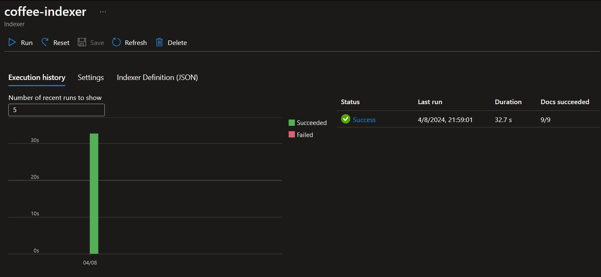

Entrega do desafio da aula "Azure Cognitive Search: Utilizando AI Search para indexação e consulta de Dados"
---

Nesse exercício fizemos o uso da AI Search para importar uma série de comentários (reviews), indexá-lo e torná-lo pesquisável. Segue os passos praticados durante a execução.
- Criar um serviço do tipo AI Search
- Criar um recurso para o Azure AI service
- Criar uma conta de armazenamento (storage account)
- Quando criar o storage, liberar o acesso anónimo de Blob (Configuration → Allow Blob anonymous access → Enabled)
- No storage, criar um container com acesso “anonymous read access for containers and blobs”
- No container criado, clicar em “Upload” e fazer o upload dos arquivos usados como teste:

- Agora que temos os documentos no storage, podemos usar o AI Search para extrair insights  deles. Para tal, acessar o AI Serach criado anteriormente e ir na opção “import data”. Na aba “Connect to your data”, selecionar o nosso storage que contém as reviews que serão processadas:

- As demais abas servem para criar o skillset, index e indexador do serviço, que praticamente vai rodar o pipeline e extrair os campos de metadados do documento e o conteúdo do data source, gerar o skillset cognitivo para gerar conteúdo mais enriquecido, mapeando eles para um index:

- Após finalizado, é possível fazer queries para extrair o conteúdo do nosso data source, porém de forma enriquecida, já conteúdo processamento de sentimentos por exemplo.

Assim, podemos concluir que a estratégia basicamente consiste em  criar um serviço de IA que faz um link com a automação direcionando ela para um repositório.

*fonte: https://microsoftlearning.github.io/mslearn-ai-fundamentals/Instructions/Labs/11-ai-search.html
